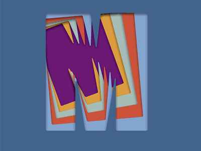
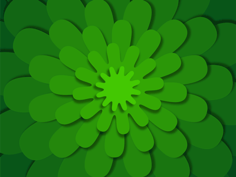
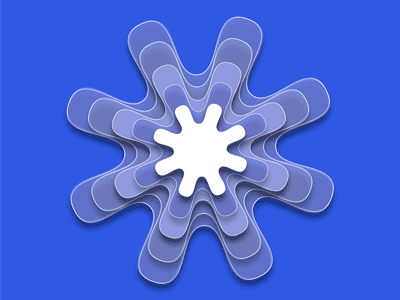
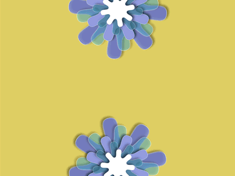

# Animations in After Effects & Javascript

 

This was a fun project where I created never ending animated gifs. They do end, but they are constructed seamlessly, so it looks like the looo forever.

Most of them were build using After Effects, I included the original files, so you it is possible to modify the animations. I used 1280 x 1280 to make it a high quality output. You can reduce the size later if you need smaller files.
Open he included files in the repo, or create your own or whatever you want in After Effects. 

If you need any help with After Effects Javascript, you can read the docs on  [https://helpx.adobe.com/after-effects/using/expression-language-reference.html](https://helpx.adobe.com/after-effects/using/expression-language-reference.html).

To make the looping animated GIF, make sure the last frame matches the first frame. So if you rotate an image, make sure it ends at the same angle as the original frame. You don't have to make a full turn, if the image is simetric, like a even pointed star (and you should always use a star with even numbers, don't make your life more complicated than it needs to be), you can rotate it quarter turn or half turn. The idea is to make the final file small. The shorter the animation, the better.

Export the full video, with the best quality possible, probably a `MOV` with `lossless` quality. Open the video in Photoshop and change the dimmension to 800x 800 pixels. Unde the `File` menu, select `Export` and `Render Video`. H.264 is a good format widelly used in mobile devices. 

Note about Instagram: They need a video of at least 3 seconds. So if you make an animation with one second, repeat the animation 3 times. Make more copies of the original layer, it should be a seamless video, no matter the length.

Under `Image Size`, select 800x800 pixels. If you added extra layers to make the video longer for Instagram, delete the extra layers. Now under `Canvas Size`, cut the height of your animation to 800 pixels wide by 600 pixels height. You will need this dimmension for Dribbble. 

To export the animated GIF, select `Save for Web`, or `Web and Devices`, the menu changes depending on the version of Photoshop. Select GIF, try reducing the number of colors, see what is acceptable to you. For web view, 128 colors might do the job. Select 400 x 300 pixels  and very important, select `Looping Optins: Forever` , so you have a looping animated GIF. 

Go ahead and share your work on social media, or use it as eye candy on your next web project.